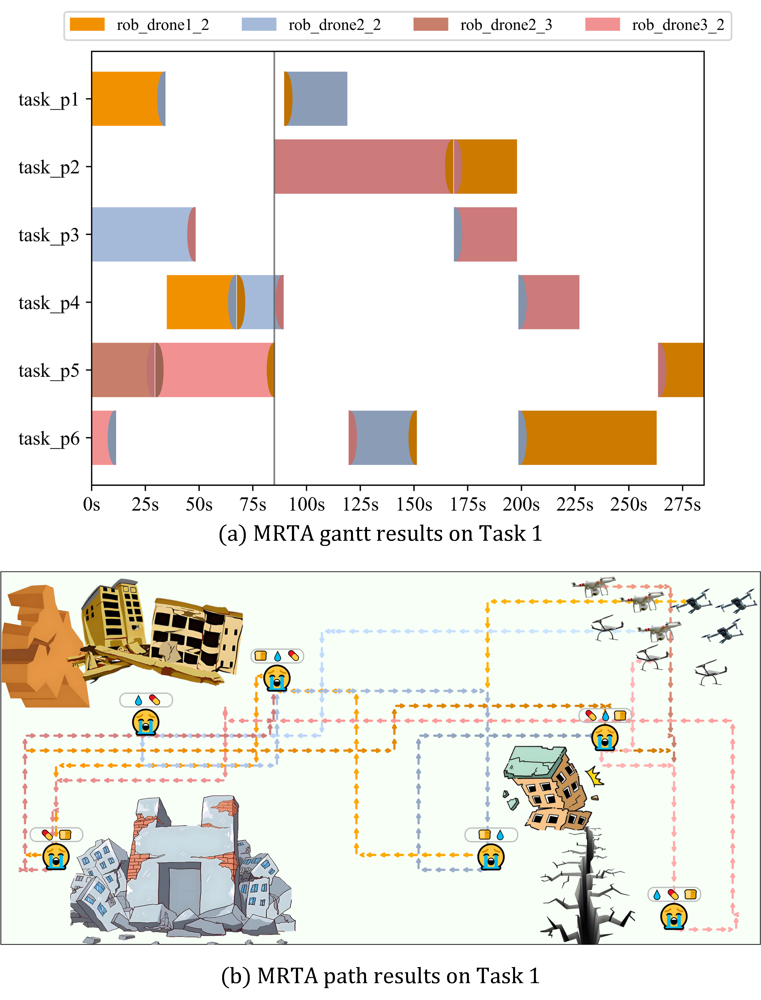
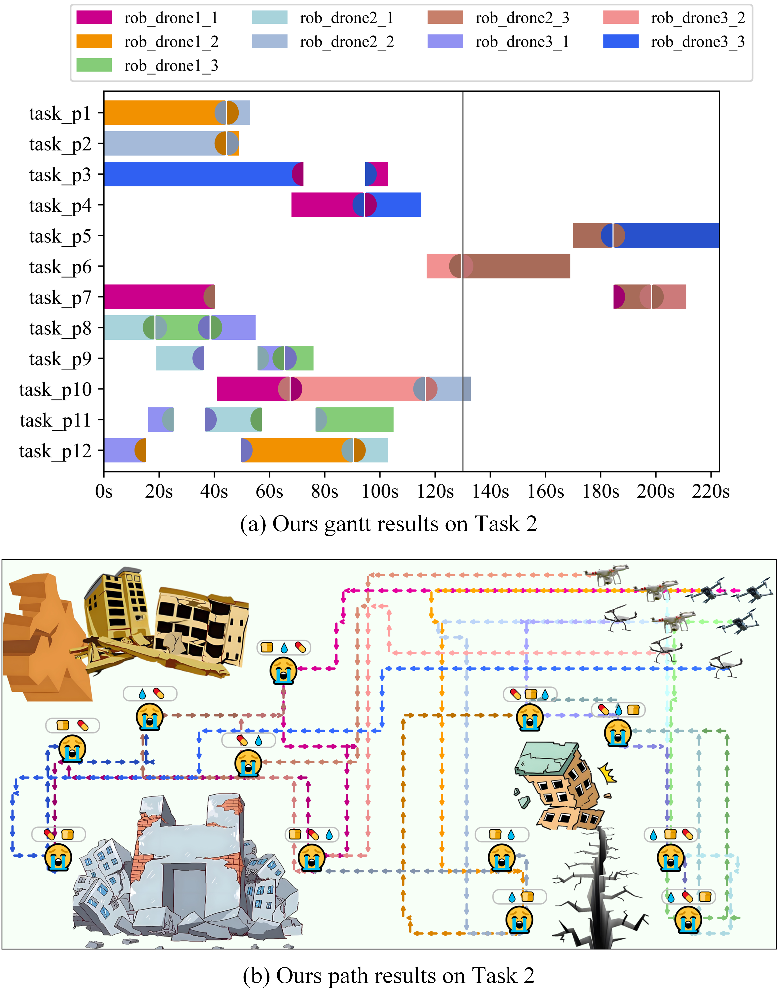

## 🌍Highly Cooperative Task Planning Based on Automated Coalition Formulation and Hierarchical Task Specification✅ ##

Welcome to HCTP, where a novel highly cooperative task planning framework with automated coalition formulation and hierarchical task specification is proposed for after-earthquake rescuing scenarios.

**Remark 1**: *This project is built and tested only on Ubuntu 20.04. However, due to its dependencies are not limited it to Linux system. Therefore, Installation of it on the windows system is also feasible.*

**Remark 2**: *This project takes usage of [Gurobi](https://www.gurobi.com) as the solver for task planning constraints. TO be noted that the academic license is free for currently enrolled students.*

## Installation⚙︎ ##
### 0. Setup the virtual environment with anaconda ###

```
conda create --name HCTP --file requirements.txt
```

[The anaconda can be installed through its official website. ]([Anaconda | The Operating System for AI](https://www.anaconda.com/)) | **Detailed  instructions available!**

### 1. Launch python file ###

```
conda activate HCTP
cd ./HCTP
python main.py --task_case=1 --planning_category=1 --replanning=0
```

# Usage🚀

### 2. Parameters ###

*To be noted that the transformed .bin files are named as the very same of its original .pcd files.*

|Name|Description|Default value|
|:---|:---|:---|
|--task_case| Task case for planning algorithm to run | 1(case 1)     |
|--planning_category|Task planning category|1(mode 1)|
|--replanning|Flag for replanning mode|1(mode on)|

# Visualization👓︎

#### 3. Running results

The project is capable of saving and visualizing the planning results as .png file with **GANTT** figure (a) and **PATH** figure (b).

The result for case 1 is:



The result for case 2 is:



**Remark 3**: *As demonstrated in the above 2 figures, path with different colors in* ***PATH*** *figure is in a gradient manner from light to dark to present the proceeding of time (lighter color for earlier in time line, as darker to later). In addition, the* ***GANTT*** *figure is also a little different from the traditional ones where the robot is in ordinate for better illustration of coperativity. The colors in* ***PATH*** *figure and* ***GANTT*** *figure are strictly corresponding.* 

## Citation

> This repository is the source for an unpublished paper. Therefore, the source will be online upon official **publication** of our work ASAP.
>

